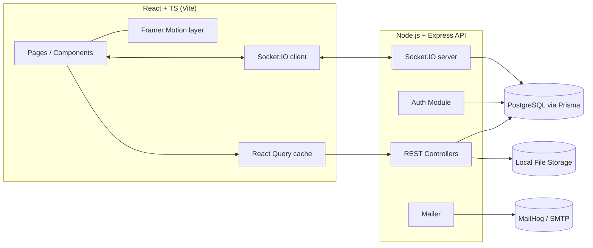
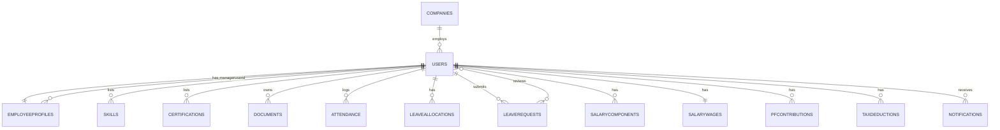

# Dayflow — HR Management System — Final Build Plan

> "Every workday, perfectly aligned."
> This document is the single source of truth for building Dayflow. Follow it phase by phase. Do not skip validation, error handling, tests, **or the design/motion system** to save time — none of those are optional polish, they are explicit requirements. **§4–§7 (data model, API, screens) now reflect the approved wireframes** — where a wireframe changed behavior from an earlier draft of this plan, that change is called out inline as "wireframe change."

## Ground Rules for the Coding Agent

- No static JSON as the real data source. A local seed script may create initial dummy rows in a real database, but every screen must read/write through the API — never hardcode arrays in the frontend as "data."
- Everything is local-first. Run Postgres, file storage, and mail in Docker/local processes. Nothing should require a paid cloud service to run end-to-end on a laptop with no internet.
- Explain before you generate. When scaffolding a non-trivial file, add a short comment block at the top explaining what the code does and why — this is a project requirement, not a nicety.
- Commit incrementally. One logical change per commit, conventional commit messages (see Git Workflow). Don't dump the whole app in one commit.
- Validate everything a human can type. Every form field needs client-side + server-side validation. Never trust the frontend alone.
- Keep the backend stack boring on purpose. REST over GraphQL, a relational DB over trendy NoSQL, no microservices. Simplicity is a feature here, not a compromise.
- The frontend is the opposite of boring. Dayflow's UI is the product's competitive edge. Do not default to generic admin-template patterns. Every screen should look and feel like it was designed by a senior product designer and built by a senior frontend engineer — see §8, "Frontend Experience & Motion System," which is binding for every phase from Phase 0 onward.
- **Build to the wireframes exactly.** §7 describes each screen's fields, actions, and role-based visibility as specified in the approved wireframes. Where §8's visual/motion language and a wireframe's literal layout could be read as conflicting, the wireframe wins on *structure* (what's on the screen, what fields exist, who can see what) and §8 wins on *treatment* (how it looks and animates).

## Project Overview

Dayflow is a Human Resource Management System (HRMS) covering:

- Company registration + secure authentication (org Sign Up, Sign In, email verification, roles)
- Admin-created employee accounts with system-generated Login IDs and passwords (no public employee self-signup)
- An Employees landing page (searchable card grid with live status indicators)
- Employee profile management (Resume, Private Info, Salary Info, Security tabs)
- Attendance tracking (check-in/out, daily/weekly/monthly views, work & extra hours)
- Leave & time-off management with balances, a calendar view, and an approval workflow
- Payroll/salary — Admin-only visibility, with auto-calculated salary components, PF, and tax
- (Phase 2 / future) Email & in-app notifications, analytics & reports (salary slips, attendance reports)

Two roles only: Admin/HR Officer and Employee.

## Tech Stack & Rationale

| Layer                 | Choice                                                                                   | Why                                                                                                                    |
| ---------------------- | ------------------------------------------------------------------------------------------- | -------------------------------------------------------------------------------------------------------------------------- |
| Frontend               | React + TypeScript (Vite)                                                                 | Fast dev loop, typed, no framework lock-in overhead                                                                    |
| Styling                | Tailwind CSS + design tokens (custom `tailwind.config.ts`)                                | Enforces a consistent design system fast, responsive utilities built in                                                |
| Animation              | Framer Motion                                                                             | Shared-element transitions, layout animations, staggered entrances, scroll-linked motion, gesture micro-interactions — §8.2 |
| Routing                | React Router v6                                                                            | Standard, no reason to reach for anything fancier                                                                      |
| Data fetching / cache  | TanStack Query (React Query)                                                               | Gives you "real-time-feeling" UI (auto-refetch, cache invalidation) without needing a full real-time stack everywhere  |
| Real-time updates      | Socket.IO (backend + client)                                                               | Used specifically where the brief demands live behavior: leave-approval status reflecting immediately, notification badges, check-in status dot |
| Backend                | Node.js + Express + TypeScript                                                             | Simple REST API, easy for an agent to scaffold predictably                                                             |
| ORM                    | Prisma                                                                                      | Type-safe schema, migrations, works great with Postgres, easy seed scripts                                             |
| Database               | PostgreSQL (run via Docker Compose locally)                                                | Relational data (users, attendance, leave, payroll) fits relational modeling far better than NoSQL                     |
| Auth                   | JWT (access + refresh tokens) + bcrypt                                                     | Stateless, simple, well understood                                                                                     |
| Email                  | Nodemailer + MailHog (local SMTP catcher) for dev; swap to real SMTP creds in prod `.env`  | Keeps verification + auto-generated-credentials emails testable fully offline                                          |
| File storage           | Local disk via Multer, path stored in DB                                                   | Avoids depending on any cloud storage provider; also backs the company logo, profile pictures, and leave attachments   |
| Testing                | Vitest/Jest + React Testing Library (frontend), Jest + Supertest (backend)                 | Standard, well-documented                                                                                              |
| Version control        | Git, GitHub/GitLab, feature branches, PRs                                                  | Required by brief — one person is not allowed to "own" the repo alone                                                  |

Explicitly avoided on the backend: GraphQL, microservices, NoSQL for core entities, third-party auth-as-a-service, cloud-only file storage, CSS-in-JS.

## System Architecture



Everything runs locally via `docker-compose up` (Postgres + MailHog) plus `npm run dev` for API and client. No external dependency is required to demo the full system offline.

## Data Model

**Wireframe change:** the data model now includes a `companies` entity (Sign Up registers a company, not a lone user), a real Login ID generation scheme, per-employee resume/private/bank fields, a normalized salary-component model that supports auto-calculation, and leave allocations/balances — none of which existed in the earlier draft.

### 4.1 companies

| Field       | Type       | Notes                          |
| ----------- | ---------- | -------------------------------- |
| id          | UUID (PK)  |                                 |
| name        | string     | shown in top nav + profile header |
| logourl     | string, nullable | uploaded at Sign Up, editable later |
| createdat / updatedat | timestamp |                     |

### 4.2 users

| Field                | Type                  | Notes                                                  |
| --------------------- | ---------------------- | --------------------------------------------------------- |
| id                    | UUID (PK)               |                                                        |
| companyid             | UUID (FK → companies)   |                                                        |
| loginid               | string, unique          | system-generated for every user — see §7.1 for the exact algorithm; never user-editable |
| email                 | string, unique          | verified via token                                     |
| phone                 | string                  |                                                        |
| passwordhash          | string                  | bcrypt                                                  |
| role                  | enum(ADMIN, EMPLOYEE)   |                                                        |
| isemailverified       | boolean                 | default false                                          |
| mustchangepassword    | boolean                 | true for Admin-created employees (system password); false once changed |
| createdat / updatedat | timestamp               |                                                        |

### 4.3 employeeprofiles

| Field              | Type                          | Notes                                             |
| ------------------- | ------------------------------ | ---------------------------------------------------- |
| id                  | UUID (PK)                       |                                                    |
| userid              | UUID (FK → users)               | 1:1                                                |
| fullname            | string                          |                                                    |
| designation         | string                          | UI label "Job Position"; admin-only edit           |
| department          | string                          | admin-only edit                                    |
| manageruserid       | UUID (FK → users), nullable     | admin-only edit                                    |
| location            | string                          | admin-only edit                                    |
| dateofjoining       | date                             | admin-only edit; also feeds Login ID generation    |
| profilepictureurl   | string, nullable                | employee-editable                                  |
| personalemail       | string, nullable                | employee-editable (distinct from login `email`)    |
| residingaddress     | string, nullable                | employee-editable                                  |
| dateofbirth         | date, nullable                  | employee-editable                                  |
| nationality         | string, nullable                | employee-editable                                  |
| gender              | string, nullable                | employee-editable                                  |
| maritalstatus       | string, nullable                | employee-editable                                  |
| bankaccountnumber   | string, nullable                | employee-editable                                  |
| bankname            | string, nullable                | employee-editable                                  |
| ifsccode            | string, nullable                | employee-editable                                  |
| panno               | string, nullable                | employee-editable                                  |
| uanno               | string, nullable                | employee-editable                                  |
| aboutme             | text, nullable                  | Resume tab, employee-editable                       |
| whatilovemyjob      | text, nullable                  | Resume tab, employee-editable                       |
| interestshobbies    | text, nullable                  | Resume tab, employee-editable                       |

`Emp Code` shown in the Private Info / Bank Details panel displays this user's `loginid` — it is not a separate stored column.

### 4.4 skills

| Field | Type | Notes |
| --- | --- | --- |
| id | UUID (PK) | |
| userid | UUID (FK) | |
| name | string | Resume tab chip list |

### 4.5 certifications

| Field | Type | Notes |
| --- | --- | --- |
| id | UUID (PK) | |
| userid | UUID (FK) | |
| name | string | Resume tab chip list |

### 4.6 documents

| Field      | Type      | Notes                       |
| ---------- | --------- | ---------------------------- |
| id         | UUID (PK) |                              |
| userid     | UUID (FK) |                              |
| doctype    | string    | e.g. "ID Proof", "Contract"  |
| fileurl    | string    | local storage path           |
| uploadedat | timestamp |                              |

### 4.7 attendance

| Field      | Type                                 | Notes                                                    |
| ---------- | ------------------------------------- | ----------------------------------------------------------- |
| id         | UUID (PK)                             |                                                            |
| userid     | UUID (FK)                             |                                                            |
| date       | date                                   |                                                            |
| checkin    | timestamp, nullable                   |                                                            |
| checkout   | timestamp, nullable                   |                                                            |
| workhours  | decimal, nullable                     | server-computed from checkin/checkout minus configured break time |
| extrahours | decimal, nullable                     | server-computed: hours beyond the configured working hours |
| status     | enum(PRESENT,ABSENT,HALFDAY,LEAVE)     |                                                            |
| note       | string, nullable                      | e.g. admin override reason                                |

Unique constraint: (userid, date).

### 4.8 leaveallocations

| Field       | Type                            | Notes                                          |
| ----------- | ---------------------------------- | -------------------------------------------------- |
| id          | UUID (PK)                          |                                                    |
| userid      | UUID (FK)                          |                                                    |
| leavetype   | enum(PAID,SICK,UNPAID)             |                                                    |
| year        | int                                 | allocation period                                 |
| totaldays   | decimal                            | Admin-managed, "Allocation" sub-tab               |
| useddays    | decimal                            | derived from approved `leaverequests`, cached     |

Drives the "24 Days Available" / "07 Days Available" balance headers on the Time Off screen (`totaldays - useddays`).

### 4.9 leaverequests

| Field                 | Type                            | Notes                                    |
| ---------------------- | ---------------------------------- | -------------------------------------------- |
| id                    | UUID (PK)                           |                                            |
| userid                | UUID (FK)                           | requester                                  |
| leavetype             | enum(PAID,SICK,UNPAID)              |                                            |
| startdate / enddate   | date                                 |                                            |
| days                  | decimal                             | server-computed from the date range        |
| remarks               | string, nullable                     | from employee                              |
| attachmenturl         | string, nullable                     | e.g. sick-leave certificate; required when leavetype = SICK |
| status                | enum(PENDING,APPROVED,REJECTED)      | default PENDING                            |
| reviewerid            | UUID (FK → users), nullable          | admin who acted                            |
| reviewercomment       | string, nullable                     | required on rejection                      |
| createdat / updatedat | timestamp                            |                                            |

### 4.10 salarywages

| Field              | Type              | Notes                                            |
| -------------------- | ------------------- | ---------------------------------------------------- |
| id                  | UUID (PK)             |                                                    |
| userid              | UUID (FK), unique      | 1:1                                                |
| wagetype            | enum(FIXED)            | Fixed Wage only for this phase                     |
| monthwage           | decimal                | ₹/month, Admin-set                                  |
| yearlywage          | decimal                | derived (`monthwage * 12`), display-only            |
| workingdaysperweek  | int                     | also drives Attendance work/extra-hours computation |
| breaktimeminutes    | int                     |                                                    |
| effectivefrom       | date                    |                                                    |
| updatedby           | UUID (FK → users)      | audit trail                                         |

### 4.11 salarycomponents

| Field           | Type                                                                | Notes                                                       |
| ----------------- | ---------------------------------------------------------------------- | ----------------------------------------------------------------- |
| id               | UUID (PK)                                                              |                                                                 |
| userid           | UUID (FK)                                                              |                                                                 |
| name             | enum(BASIC,HRA,STANDARD_ALLOWANCE,PERFORMANCE_BONUS,LTA,FIXED_ALLOWANCE) |                                                                 |
| computationtype  | enum(PERCENTAGE,FIXED)                                                 |                                                                 |
| basisof          | enum(WAGE,BASIC)                                                       | percentage computed against Month Wage or against Basic Salary |
| value            | decimal                                                                | percentage or fixed ₹ amount, depending on `computationtype`   |
| computedamount   | decimal                                                                | server-computed ₹/month, recalculated whenever `monthwage` changes |
| description      | string, nullable                                                       | the helper copy shown under each component in the wireframe    |

Server-side rule: `sum(computedamount)` across all components must never exceed `monthwage`; `FIXED_ALLOWANCE` is always the remainder (`monthwage - sum(other components)`).

### 4.12 pfcontributions

| Field           | Type                     | Notes                              |
| ----------------- | -------------------------- | -------------------------------------- |
| id               | UUID (PK)                   |                                       |
| userid           | UUID (FK)                   |                                       |
| payer            | enum(EMPLOYEE,EMPLOYER)     | two rows per employee                |
| ratepercent      | decimal                     | e.g. 12.00                            |
| computedamount   | decimal                     | computed on Basic Salary             |

### 4.13 taxdeductions

| Field    | Type       | Notes                                  |
| -------- | ---------- | ----------------------------------------- |
| id       | UUID (PK)  |                                         |
| userid   | UUID (FK)  |                                         |
| name     | string     | e.g. "Professional Tax"                 |
| amount   | decimal    | flat ₹/month, deducted from gross salary |

### 4.14 notifications (Phase 2)

| Field     | Type                                       | Notes         |
| --------- | --------------------------------------------- | ----------------- |
| id        | UUID (PK)                                     |                 |
| userid    | UUID (FK)                                     | recipient       |
| message   | string                                        |                 |
| type      | enum(LEAVEUPDATE,ATTENDANCEALERT,GENERAL)     |                 |
| isread    | boolean                                       | default false   |
| createdat | timestamp                                     |                 |



## API Specification

All routes prefixed `/api/v1`. All protected routes require `Authorization: Bearer <token>`. Admin-only routes additionally check `role === ADMIN` in middleware.

### Company & Auth

| Method | Route                       | Access | Description                                                                 |
| ------ | ---------------------------- | ------ | ------------------------------------------------------------------------------- |
| POST   | /auth/signup                 | Public | Company Name, Logo (multipart), Name, Email, Phone, Password, Confirm Password → creates `companies` row + first ADMIN user |
| GET    | /auth/verify-email?token=    | Public | verifies email via emailed token                                              |
| POST   | /auth/signin                 | Public | Login ID **or** Email + Password → access + refresh token                     |
| POST   | /auth/refresh                | Public | rotates access token                                                          |
| POST   | /auth/logout                 | Auth   | invalidates refresh token                                                     |
| PATCH  | /auth/change-password        | Auth   | current password (omit when `mustchangepassword` is true) + new + confirm; clears `mustchangepassword` |
| GET    | /company                     | Auth   | company name + logo, for the top nav                                          |
| PATCH  | /company                     | Admin  | update company name / logo                                                    |

### Employees / Profile

| Method | Route                          | Access      | Description                                                                                     |
| ------ | -------------------------------- | ------------ | ---------------------------------------------------------------------------------------------------- |
| GET    | /users                           | Auth         | Employees grid — paginated, searchable, each row includes today's computed status (PRESENT/ON_LEAVE/ABSENT) |
| POST   | /users                           | Admin        | create employee — server auto-generates `loginid` (see §7.1) + temp password, emails credentials, creates default `leaveallocations` |
| GET    | /users/me                        | Auth         | full own profile, all tabs                                                                       |
| PATCH  | /users/me                        | Auth         | edit own employee-editable fields (§4.3)                                                          |
| GET    | /users/:id                       | Auth         | any employee's profile — full detail for Admin, **view-only** payload (no Salary Info) for Employee viewers |
| PATCH  | /users/:id                       | Admin        | edit any field, including department/designation/date of joining/manager                          |
| POST   | /users/:id/documents             | Admin/Self   | upload document                                                                                    |
| POST / DELETE | /users/:id/skills          | Admin/Self   | add/remove a skill chip                                                                            |
| POST / DELETE | /users/:id/certifications   | Admin/Self   | add/remove a certification chip                                                                    |

### Attendance

| Method | Route                             | Access           | Description                                                                    |
| ------ | ------------------------------------ | ------------------ | ----------------------------------------------------------------------------------- |
| POST   | /attendance/check-in                 | Auth (Employee)     | creates today's record                                                            |
| POST   | /attendance/check-out                | Auth (Employee)     | updates today's record, computes `workhours` / `extrahours`                       |
| GET    | /attendance/me?month=                | Auth                | day-wise list for the month + summary (days present, leaves count, total hours)   |
| GET    | /attendance/:userId?month=           | Admin               | any employee's attendance, same shape                                              |
| GET    | /attendance?date=                    | Admin               | all employees for a given day                                                      |
| PATCH  | /attendance/:id                      | Admin               | override status manually                                                           |

### Leave & Allocations

| Method | Route                        | Access             | Description                                            |
| ------ | ------------------------------- | -------------------- | ------------------------------------------------------------ |
| GET    | /leave/allocations/me            | Auth                  | own Paid/Sick/Unpaid balances                              |
| GET    | /leave/allocations/:userId       | Admin                 | one employee's balances                                    |
| PUT    | /leave/allocations/:userId       | Admin                 | set/adjust a leave type's `totaldays` — Allocation sub-tab |
| POST   | /leave                           | Auth (Employee)        | apply for leave (multipart when Sick + attachment)         |
| GET    | /leave/me                        | Auth                   | own leave history, calendar-friendly shape                 |
| GET    | /leave                           | Admin                  | all leave requests, filterable by status/employee           |
| PATCH  | /leave/:id/decision              | Admin                  | approve/reject + comment                                    |

### Payroll (Admin-only)

| Method | Route                       | Access | Description                                                              |
| ------ | ----------------------------- | ------ | ------------------------------------------------------------------------------ |
| GET    | /payroll/:userId               | Admin   | full salary object: wage, components (with computed amounts), PF, tax        |
| PUT    | /payroll/:userId/wage           | Admin   | set Month Wage / working days per week / break time                          |
| PUT    | /payroll/:userId/components      | Admin   | set/update the component list; server recalculates and validates total ≤ wage |
| PUT    | /payroll/:userId/pf             | Admin   | set Employee/Employer PF contribution rates                                  |
| PUT    | /payroll/:userId/tax            | Admin   | set tax deductions (e.g. Professional Tax)                                   |

**Wireframe change:** there is no `/payroll/me` surfaced in the UI for this phase — Salary Info is Admin-only (§7.6). The endpoint shape above deliberately omits an employee-facing read route; add one only if a future phase reintroduces employee-visible payslips.

### Notifications (Phase 2)

| Method | Route                      | Access | Description         |
| ------ | ---------------------------- | ------ | ---------------------- |
| GET    | /notifications                | Auth   | own notifications    |
| PATCH  | /notifications/:id/read       | Auth   | mark as read          |

### Reports (Phase 2)

| Method | Route                                  | Access      | Description                       |
| ------ | ----------------------------------------- | ------------- | ------------------------------------ |
| GET    | /reports/attendance-summary?month=         | Admin         | aggregated attendance stats       |
| GET    | /reports/salary-slip/:userId?month=        | Admin         | generates a salary slip payload, sourced from §4.10–4.13 |

## Repository Structure

```text
dayflow/
├── docker-compose.yml           # postgres + mailhog
├── plan.md
├── server/
│   ├── prisma/
│   │   ├── schema.prisma
│   │   └── seed.ts
│   ├── src/
│   │   ├── modules/
│   │   │   ├── auth/
│   │   │   ├── companies/
│   │   │   ├── users/            # employees, profile, skills, certifications
│   │   │   ├── attendance/
│   │   │   ├── leave/            # requests + allocations
│   │   │   ├── payroll/          # wage, components, pf, tax
│   │   │   └── notifications/
│   │   ├── middleware/           # auth guard, role guard, error handler, validators
│   │   ├── sockets/
│   │   ├── lib/                  # prisma client, mailer, file storage helpers, loginid generator
│   │   └── app.ts / server.ts
│   ├── tests/
│   └── package.json
└── client/
    ├── src/
    │   ├── pages/
    │   │   ├── auth/ (SignUp [company registration], SignIn, VerifyEmail, ChangePassword)
    │   │   ├── employees/ (EmployeesGrid, EmployeeDetail [view-only])
    │   │   ├── profile/ (MyProfile: ResumeTab, PrivateInfoTab, SalaryInfoTab, SecurityTab)
    │   │   ├── attendance/
    │   │   └── leave/ (TimeOffList, Allocation, Calendar, RequestModal)
    │   ├── components/
    │   │   ├── ui/                # Button, Input, Card, Badge, Table, Modal, Toast, StatusDot
    │   │   ├── layout/             # TopNav, AvatarMenu, CheckInOutWidget, MobileNav
    │   │   └── motion/             # AnimatedPage, StaggerList, SharedElementCard, ScrollShowcase, MotionConfigProvider
    │   ├── hooks/                  # useAuth, useAttendance, useLeave, useReducedMotion, etc.
    │   ├── api/                    # axios instance + typed API calls
    │   ├── context/                # AuthContext
    │   ├── styles/                 # design tokens (type scale, gradients, elevation)
    │   └── App.tsx / main.tsx
    └── package.json
```

## Feature Modules — Detailed Behavior

### 7.1 Authentication & Employee Onboarding

- **Sign Up (public)** registers the **company**, not an individual employee: Company Name, Company Logo upload, Name, Email, Phone, Password, Confirm Password (both password fields get a show/hide toggle). Creates the `companies` row and the first ADMIN user. On submit, sends a verification email via MailHog.
- **Employees are never self-registered** (wireframe change from the earlier draft, which allowed employee self-signup with a chosen role). Only Admin/HR can create an employee, from the Employees page's "NEW" button (§7.2):
  - The server auto-generates a unique **Login ID**: `{CompanyCode}{First2LettersOfFirstName}{First2LettersOfLastName}{YearOfJoining}{4-digit serial}` — e.g. `OIJODO20220001`, where `OI` is the company's code, `JODO` is the first two letters of the employee's first name plus first two letters of their last name, `2022` is the year of joining, and `0001` is that year's join serial number (incrementing on collision).
  - The server auto-generates a temporary password and emails the Login ID + temp password to the employee's email (MailHog locally).
  - `mustchangepassword` is set to `true`.
- **Sign In** accepts Login ID **or** Email + Password. Wrong credentials → inline error, no vague "something went wrong."
- A user with `mustchangepassword = true` is routed to the Security tab's change-password flow before they can use the rest of the app.
- Password policy (min 8 chars, 1 number, 1 symbol) applies to both the Admin's self-chosen signup password and any password change.

### 7.2 Employees (Landing Page)

**Wireframe change:** there is no separate "dashboard" screen. After login, every user — Admin and Employee alike — lands directly on the **Employees** page.

- Persistent top nav: Company Logo · Employees · Attendance · Time Off, plus an avatar (with a live status dot) on the far right opening a dropdown: **My Profile**, **Log Out**.
- A searchable grid of employee cards (photo + name), each with a status indicator in its top-right corner reflecting *today's* attendance/leave state:
  - green dot — present in the office
  - airplane icon — on approved leave today
  - yellow dot — absent (no attendance recorded, no leave applied)
- Admin/HR see a **NEW** button that opens the create-employee form described in §7.1.
- Clicking any card opens that employee's profile in **view-only** mode (no edit controls, no Security tab) — except for the profile's own owner and Admin viewers, who get the editable form (§7.3).
- A persistent **Check In / Check Out** systray widget sits near the avatar: "Check In ->" flips the avatar's status dot red → green and the widget switches to "Since HH:MM AM/PM" with a "Check Out ->" action. Buttons disable once already used for the day.

### 7.3 Profile Management

- "My Profile" (from the avatar dropdown) opens an editable form with four tabs: **Resume, Private Info, Salary Info (Admin-only), Security**.
  - **Header** (all tabs): profile photo, full name, Job Position (designation), Login ID, company email, mobile — plus Company, Department, Manager, Location.
  - **Resume**: free-text *About*, *What I love about my job*, *My interests and hobbies*; add/remove **Skills** and **Certifications** as chip lists.
  - **Private Info**: Date of Birth, Residing Address, Nationality, Personal Email, Gender, Marital Status, Date of Joining (left column); **Bank Details** — Account Number, Bank Name, IFSC Code, PAN No, UAN No, Emp Code (right column, Emp Code = Login ID).
  - **Salary Info**: see §7.6 — rendered only when the *viewer* is Admin; absent from the tab list entirely for Employee viewers, including on their own profile.
  - **Security**: change-password form (current password field hidden during a forced first change), enforcing the password policy.
- Employee-editable fields: phone, personal email, residing address, date of birth, nationality, gender, marital status, profile picture, bank details. Department, Designation, Date of Joining, Manager, and Location remain **admin-only edit**, enforced at the API layer, not just hidden in the UI.
- Viewing someone else's card opens the same tabbed layout in **view-only** mode: no Security tab, no edit affordances anywhere, and Salary Info still gated to Admin viewers only.

### 7.4 Attendance

- **Employee view**: date navigation (prev/next, month picker), a summary strip — Count of Days Present, Leaves Count, Total Working Hours — and a day-wise table (Date, Check In, Check Out, Work Hours, Extra Hours), defaulting to the ongoing month, own records only.
- **Admin/HR view**: a searchable, date-scoped table (date + day picker) listing every employee present that day (Employee, Check In, Check Out, Work Hours, Extra Hours).
- Check-in/check-out buttons disable once already used for the day; can't check out before checking in.
- `Work Hours` / `Extra Hours` are computed server-side from check-in/check-out against the employee's configured working days/week and break time (§7.6's Salary Info).
- Attendance is the source of truth for payable-days computation (Phase 8 payroll/reports): unpaid leave or missing attendance automatically reduces payable days.

### 7.5 Time Off

- Both roles see leave-type balances at the top of the **Time Off** tab (e.g. "Paid Time Off — 24 Days Available", "Sick Time Off — 07 Days Available"), derived from §4.8's allocations, and a **NEW** button opening a **"Time off Type Request"** modal: Employee (self, read-only), Time Off Type (Paid Time Off / Sick Leave / Unpaid Leave), Validity Period (date range), Allocation (days — computed from the range, editable), Attachment upload (for a sick-leave certificate), Submit/Discard.
- **Employee view**: below the balances, a full-year calendar visualizes leave days with a running legend list of entries (date + type/status). Employees see and apply for only their own time off.
- **Admin/HR view**: a second sub-tab, **Allocation**, for setting each employee's leave balances; the primary **Time Off** sub-tab lists every request (Name, Start Date, End Date, Time Off Type, Status) with inline **Reject**/**Approve** actions and a search bar to filter by status/employee. Rejecting requires a comment.
- Status lifecycle: Pending → Approved/Rejected, pushed to the employee instantly via Socket.IO + React Query cache invalidation; the decided row animates out of the Admin queue (layout animation on the rest).

### 7.6 Payroll / Salary Info

**Wireframe change:** Salary Info is now **Admin-only** — hidden from the Employee role entirely, even on their own profile. (The earlier draft of this plan gave employees a read-only salary view; the approved wireframe explicitly labels the tab "Should only be visible to Admin." Employee-facing payslips are deferred to Phase 8 if reintroduced.)

- **Wage**: Wage Type is Fixed Wage for this phase. Admin sets **Month Wage** (₹/month); **Yearly Wage** (× 12) is derived and shown read-only. **No. of Working Days/Week** and **Break Time** are configured here and feed Attendance's Work/Extra Hours.
- **Salary Components**: Basic Salary, House Rent Allowance, Standard Allowance, Performance Bonus, Leave Travel Allowance, Fixed Allowance. Each has a computation type (Fixed Amount or % of Wage/Basic) and a value; the server computes and displays the resulting ₹/month for each, recalculating automatically whenever Month Wage changes. Fixed Allowance is always the remainder (`Wage - sum(other components)`); the server rejects any configuration whose total exceeds the Wage.
- **Provident Fund (PF)**: separate Employee and Employer contribution rows, each a configurable rate (%) computed on Basic Salary.
- **Tax Deductions**: Professional Tax as a configurable flat ₹/month amount, deducted from gross salary.
- The client only ever *displays* server-computed figures — payroll math never runs client-side. Every change carries an audit trail (`updatedby`, `effectivefrom`).

### 7.7 Notifications & Reports (Phase 2 / Future Enhancements)

- In-app notification bell + optional email alert on leave decisions and attendance anomalies (e.g., 3 consecutive absences).
- Reports dashboard: attendance summary per month, salary-slip view per employee sourced from §4.10–4.13 (rendered in-app; PDF export is a stretch goal via `pdfkit`). This remains the natural home for the one sanctioned scroll-linked showcase moment (§8.2).

## 8. Frontend Experience & Motion System

This section is binding, not aspirational. The explicit brief:

> Build Dayflow as a premium, production-quality HR SaaS application. Do not make it look like a generic admin dashboard or a template. Use a strong visual hierarchy, oversized typography, asymmetric bento layouts, sophisticated spacing, subtle gradients, layered surfaces, responsive interactions and polished micro-interactions. Use Framer Motion for shared-element transitions, layout animations, staggered entrances and state transitions. Use scroll-linked motion sparingly for showcase sections. Every interaction should have a deliberate visual response. Prioritize performance, accessibility and responsive behavior. The design should feel like a senior frontend engineer built it — not like an AI-generated dashboard.

### 8.1 Visual Language

- **Typography**: a deliberate pairing — a display face for headlines (large, tight tracking) and a distinct, highly-legible sans for body/data (tabular figures for numbers like salary and attendance counts). Define a fluid type scale with `clamp()` so headline sizes scale smoothly across breakpoints.
- **Layout**: since there's no standalone dashboard screen (§7.2), asymmetric bento-style grouping applies wherever the wireframes call for a stat summary — the Employees card grid itself, the Attendance summary strip (Days Present / Leaves / Total Hours), and the Time Off balance headers — mixed cell sizes and intentional hierarchy rather than uniform rows. Spacing follows a single 4/8px-based scale defined once as tokens.
- **Layered surfaces**: an elevation system (`surface-0` through `surface-3`) combining subtle box-shadow, 1px gradient borders, and occasional `backdrop-blur` for glass-like elevated panels (the Time Off request modal, the employee detail view-only overlay, the avatar dropdown). Flat white cards on a flat white background are the thing being explicitly avoided.
- **Gradients**: subtle, used as accents — radial glows behind attendance/leave stat numbers, a soft mesh gradient behind the auth screens, a gradient border on the active top-nav item — never as large flat color fills. Define gradient tokens once (`--gradient-primary`, `--gradient-surface`).
- **Color palette** (base tokens, defined once in `tailwind.config.ts` and extended with the elevation/gradient tokens above):

| Token         | Hex                 | Use                                  |
| -------------- | -------------------- | --------------------------------------- |
| primary        | #0F766E (teal-700)   | primary buttons, active nav, links    |
| primary-light  | #2DD4BF (teal-400)   | accents, highlights, hover states     |
| ink            | #1E293B               | body text                             |
| background     | #F8FAFC               | page background                       |
| surface        | #FFFFFF               | base card/modal surface (layered per §8.1) |
| success        | #16A34A               | Approved / Present / green status dot  |
| warning        | #D97706               | Pending / Half-day / yellow status dot |
| danger         | #DC2626               | Rejected / Absent                     |
| muted          | #94A3B8               | secondary text, disabled states       |

- **Status indicators**: the green/yellow status dot and the "on leave" airplane icon (§7.2) are first-class design elements, not afterthought badges — consistent size, consistent placement (card corner, avatar), consistent motion (see §8.2) whenever they change.
- **Iconography**: one consistent icon set (e.g. Lucide) at consistent stroke width and size per context.
- Empty, loading, and error states get the same design attention as the happy path: skeleton loaders with a shimmer sweep, not bare spinners; empty states get an illustration/icon + a clear next action.

### 8.2 Motion System (Framer Motion)

Framer Motion is the animation engine for the whole client, wired through reusable primitives in `client/src/components/motion/`:

- **Shared-element transitions** (`layoutId`): an Employees-grid card → its (view-only or editable) profile; a Time Off request row → its decision context. The clicked element visually morphs into the opened surface.
- **Layout animations**: any list that reorders or removes items (the Admin approval queue after a decision, the Attendance table after a date/filter change) animates the remaining items into their new positions.
- **Staggered entrances**: Employees-grid cards, attendance rows, and leave-history entries enter with `staggerChildren` / `delayChildren` on mount and on route change — fast (≈20–40ms stagger).
- **State transitions**: buttons/inputs get spring-based hover/press feedback; the status dot / airplane icon animates (not snaps) when an employee's status changes; leave status badges animate color+icon+label together on decision; toasts spring in/out; the Check-In widget's red→green dot flip is a deliberate, satisfying transition since it's the action every employee performs daily.
- **Page transitions**: route changes choreographed via `AnimatePresence` at the router boundary.
- **Scroll-linked motion — used sparingly, for showcase moments only**: one or two places, e.g. the Reports dashboard (§7.7) or the year-view leave calendar's reveal (§7.5), using `useScroll` + `useTransform`. Not applied to ordinary list scrolling or tables anywhere else.
- Every animation has a **reduced-motion fallback** (instant or opacity-only) via a single shared `useReducedMotion` check / `MotionConfig`.

### 8.3 Performance & Accessibility (explicit requirements, not optional polish)

- Animate `transform` and `opacity` only wherever possible; use `layout` animations or transforms instead of animating layout-triggering properties directly.
- Code-split routes; lazy-load motion-heavy sections (the scroll-linked showcase, the year-view calendar) so they don't block the Employees grid's initial render.
- `will-change` used sparingly and only on actively-animating elements.
- Respect `prefers-reduced-motion` globally through the shared motion config.
- All interactive elements are keyboard-reachable with visible, on-brand focus rings.
- Verify WCAG AA contrast for text on gradient, glass, or elevated surfaces — including the status dots/icons against their card backgrounds.
- Target smooth 60fps for all transitions; sanity-check on a throttled/mid-tier device profile.
- **Layout**: a persistent **top navigation bar** (Company Logo · Employees · Attendance · Time Off · avatar menu) on all breakpoints — matching the wireframes exactly — collapsing to a condensed/hamburger top bar under 768px rather than a sidebar; the collapse itself is an animated transition, not an instant swap.
- Responsiveness breakpoints: mobile <640px, tablet 640–1024px, desktop >1024px. The Employees grid reflows (3-up → 2-up → 1-up), the Attendance/Time Off tables become scrollable or card-stacked, and the year-view calendar collapses to a month-at-a-time view on mobile.
- Components to build once, reuse everywhere: Button, Input (with built-in error state), Select, DatePicker, Card, StatusBadge, StatusDot, Table, Modal, Toast, plus the motion primitives in §8.2.
- Feedback: every async action (submit, approve, check-in) shows a loading state and a success/error toast, each with a deliberate enter/exit animation. No silent failures.

## Validation Rules (client + server, both required)

| Field                          | Rule                                                                                    |
| -------------------------------- | -------------------------------------------------------------------------------------------- |
| Email                            | valid format, uniqueness checked server-side                                               |
| Password                         | ≥8 chars, 1 number, 1 symbol                                                                 |
| Login ID                         | system-generated only, never user-editable; uniqueness enforced with an incrementing serial on collision |
| Leave date range                 | end ≥ start, no overlap with existing pending/approved leave                                |
| Leave balance (Paid/Sick)        | requested days cannot exceed the employee's available balance for that leave type; Unpaid has no cap |
| Sick leave attachment            | required when Time Off Type = Sick Leave                                                    |
| Check-in/out                     | can't check out before checking in; can't double check-in same day                          |
| Phone                            | numeric, length-checked per locale                                                          |
| Salary components total          | sum of all component ₹/month amounts must not exceed Month Wage                             |
| Salary fields                    | non-negative decimals only, admin-only write access                                         |
| File uploads                     | type restricted (jpg/png for photos, pdf for documents/attachments), size-capped (e.g., 5MB) |

## Non-Functional Requirements

- Security: bcrypt password hashing, JWT with short-lived access tokens + refresh rotation, role checks on every protected route, rate-limit auth endpoints.
- Performance: paginate all list endpoints (Employees grid, attendance, leave requests); index `userid` and `date` columns. Frontend performance requirements are detailed in §8.3.
- Offline/local-first compliance: the entire stack (DB, mail, file storage) must run via Docker Compose + npm scripts with zero required external cloud accounts, including delivery of auto-generated employee credentials (via MailHog). Document this clearly in README.md.
- Data integrity: use Prisma migrations, never edit the DB schema by hand once migrations exist.
- Accessibility: semantic HTML, labeled form inputs, sufficient color contrast (verify status dots/badges and gradient/glass-surface colors against WCAG AA — see §8.3).

## Build Phases (work through these in order)

### Phase 0 — Scaffolding

- Init monorepo folders (`client/`, `server/`), Docker Compose for Postgres + MailHog.
- Set up Prisma schema from §4, run first migration, write seed script with a handful of dummy users (1 admin, 4–5 employees) for local testing only.
- Set up Express app skeleton with error-handling middleware and health-check route.
- Set up React app with Tailwind, routing shell, and the reusable UI component library.
- Design foundations: design tokens (type scale, spacing, color + gradient + elevation), install Framer Motion, build the core motion primitives from §8.2.

### Phase 1 — Authentication & Employee Onboarding

- Backend: company signup (creates `companies` + first ADMIN), email verification, signin (loginid/email), refresh, logout, change-password; the `loginid` generator (§7.1) with collision handling; Admin-create-employee endpoint that auto-generates loginid + temp password and emails credentials; JWT middleware; role guard middleware.
- Frontend: Sign Up (company registration, logo upload), Sign In, Verify Email, Change Password / forced-first-change flow; `AuthContext`; protected route wrapper; the Employees grid landing page (cards, status dots, search, Admin "NEW" button) and click-through to a view-only employee page.
- Tests: password validation, duplicate email rejection, wrong-password error path, loginid generation + collision increment.

### Phase 2 — Profiles

- Backend: profile CRUD with field-level permission checks (employee vs admin), skills/certifications sub-resources.
- Frontend: My Profile with Resume, Private Info, and Security tabs (Salary Info wired in Phase 5); view-only rendering for non-owner/non-admin viewers; file upload for profile picture/documents.

### Phase 3 — Attendance

- Backend: check-in/check-out (with work/extra-hours computation), daily/monthly queries, admin override.
- Frontend: check-in/out systray widget with the red→green status-dot transition, employee day-wise view + summary strip, admin all-employee-for-a-day table.

### Phase 4 — Leave Management

- Backend: apply (with attachment), list, allocations CRUD, approve/reject with comment, overlap/balance validation.
- Frontend: apply-for-leave modal, balance headers, employee year-view calendar, admin Time Off + Allocation sub-tabs with layout-animated row removal on decision.
- Wire Socket.IO so a decision pushes an instant update to the employee's dashboard.

### Phase 5 — Payroll / Salary Info

- Backend: wage, components (with server-side auto-calculation and the ≤-wage validation), PF, tax endpoints, all Admin-only.
- Frontend: Salary Info tab wired into Profile, rendered only for Admin viewers, with live-recalculating component amounts as Month Wage changes.

### Phase 6 — Landing Experience & Polish

- Refine the Employees grid's motion (staggered card entrance, shared-element transition into profiles) and the bento-style stat groupings in Attendance/Time Off.
- Implement the one or two sanctioned scroll-linked showcase moments (§8.2) — nowhere else.
- Full responsive pass across all pages; empty/loading/error states everywhere, each with intentional motion.
- Full accessibility + reduced-motion pass across every animated component.

### Phase 7 — Testing & Hardening

- Backend integration tests per module (Supertest), including loginid generation edge cases.
- Frontend component/interaction tests for auth, employee creation, leave apply, attendance check-in.
- Manual QA pass against every rule in Validation Rules, plus §8.3 (performance/accessibility/reduced-motion).

### Phase 8 — Future Enhancements (only after 0–7 are solid)

- In-app + email notifications on leave decisions and attendance anomalies.
- Analytics/reports dashboard: attendance summary, salary-slip generation from §4.10–4.13 (revisit whether employees get a read-only payslip view at this point).

## Git Workflow

- Branch naming: `feature/leave-approval`, `fix/attendance-overlap-bug`.
- Conventional commits: `feat:`, `fix:`, `chore:`, `test:`, `docs:`.
- One PR per phase-item, not one PR per phase. Small, reviewable diffs.
- No direct commits to `main`; require at least a self-review checklist before merge (does it match this plan's spec — including the exact wireframe fields/actions in §7 — for that module?).

## Definition of Done (per module)

A module is done when:

- [ ] API routes match §5 exactly (method, path, access control)
- [ ] All relevant validation rules are enforced server-side
- [ ] Frontend has loading/error/empty states, each with intentional motion
- [ ] Responsive at mobile/tablet/desktop
- [ ] Matches the corresponding wireframe screen — exact fields, role-based visibility, and actions from §7 — styled per §8 (layered surfaces, type scale, spacing, bento groupings)
- [ ] Any list, status change, or navigation in this module uses the appropriate Framer Motion primitive from §8.2 rather than an instant/un-animated change
- [ ] Reduced-motion fallback verified for this module's animations
- [ ] At least one automated test covers the happy path and one failure path
- [ ] No hardcoded/static data remains in the frontend for this module
