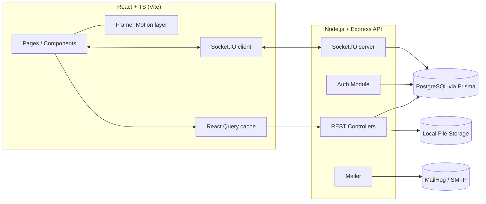
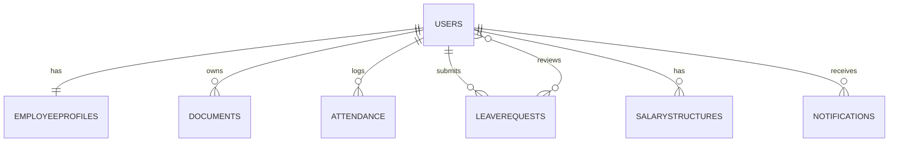

# Dayflow — HR Management System — Build Plan

> "Every workday, perfectly aligned."
> This document is the single source of truth for building Dayflow. Follow it phase by phase. Do not skip validation, error handling, tests, **or the design/motion system** to save time — none of those are optional polish, they are explicit requirements.

## Ground Rules for the Coding Agent

- No static JSON as the real data source. A local seed script may create initial dummy rows in a real database, but every screen must read/write through the API — never hardcode arrays in the frontend as "data."
- Everything is local-first. Run Postgres, file storage, and mail in Docker/local processes. Nothing should require a paid cloud service to run end-to-end on a laptop with no internet.
- Explain before you generate. When scaffolding a non-trivial file, add a short comment block at the top explaining what the code does and why — this is a project requirement, not a nicety.
- Commit incrementally. One logical change per commit, conventional commit messages (see Git Workflow). Don't dump the whole app in one commit.
- Validate everything a human can type. Every form field needs client-side + server-side validation. Never trust the frontend alone.
- Keep the backend stack boring on purpose. REST over GraphQL, a relational DB over trendy NoSQL, no microservices. Simplicity is a feature here, not a compromise.
- **The frontend is the opposite of boring.** Dayflow's UI is the product's competitive edge. Do not default to generic admin-template patterns (plain sidebar + flat white cards + default shadcn spacing). Every screen should look and feel like it was designed by a senior product designer and built by a senior frontend engineer — see "Frontend Experience & Motion System" below, which is binding for every phase from Phase 0 onward, not a Phase 6 add-on.

## Project Overview

Dayflow is a Human Resource Management System (HRMS) covering:

- Secure authentication (Sign Up / Sign In, email verification, roles)
- Role-based dashboards (Employee vs Admin/HR)
- Employee profile management
- Attendance tracking (check-in/out, daily/weekly views)
- Leave & time-off management with approval workflow
- Payroll/salary visibility (read-only for employees, editable for admin)
- (Phase 2 / future) Email & in-app notifications, analytics & reports (salary slips, attendance reports)

Two roles only: Admin/HR Officer and Employee.

## Tech Stack & Rationale

| Layer                 | Choice                                                                                   | Why                                                                                                                    |
| ---------------------- | ----------------------------------------------------------------------------------------- | ------------------------------------------------------------------------------------------------------------------------ |
| Frontend               | React + TypeScript (Vite)                                                                 | Fast dev loop, typed, no framework lock-in overhead                                                                    |
| Styling                | Tailwind CSS + design tokens (custom `tailwind.config.ts`)                                | Enforces a consistent design system fast, responsive utilities built in                                                |
| Animation              | **Framer Motion**                                                                          | Shared-element transitions, layout animations, staggered entrances, scroll-linked motion, gesture-driven micro-interactions — see dedicated section below |
| Routing                | React Router v6                                                                            | Standard, no reason to reach for anything fancier                                                                      |
| Data fetching / cache  | TanStack Query (React Query)                                                               | Gives you "real-time-feeling" UI (auto-refetch, cache invalidation) without needing a full real-time stack everywhere  |
| Real-time updates      | Socket.IO (backend + client)                                                               | Used specifically where the brief demands live behavior: leave-approval status reflecting immediately, notification badges |
| Backend                | Node.js + Express + TypeScript                                                             | Simple REST API, easy for an agent to scaffold predictably                                                             |
| ORM                    | Prisma                                                                                      | Type-safe schema, migrations, works great with Postgres, easy seed scripts                                             |
| Database               | PostgreSQL (run via Docker Compose locally)                                                | Relational data (users, attendance, leave, payroll) fits relational modeling far better than NoSQL — a deliberate anti-trend choice |
| Auth                   | JWT (access + refresh tokens) + bcrypt                                                     | Stateless, simple, well understood                                                                                     |
| Email                  | Nodemailer + MailHog (local SMTP catcher) for dev; swap to real SMTP creds in prod `.env`  | Keeps verification emails testable fully offline                                                                       |
| File storage           | Local disk via Multer, path stored in DB                                                   | Avoids depending on any cloud storage provider — satisfies "don't rely entirely on cloud-based tools"                  |
| Testing                | Vitest/Jest + React Testing Library (frontend), Jest + Supertest (backend)                 | Standard, well-documented                                                                                              |
| Version control        | Git, GitHub/GitLab, feature branches, PRs                                                  | Required by brief — one person is not allowed to "own" the repo alone                                                  |

Explicitly avoided on the backend: GraphQL, microservices, NoSQL for core entities, third-party auth-as-a-service, cloud-only file storage, CSS-in-JS. None of these add value here — they'd only add trendy complexity to a domain (HR data) that maps cleanly onto relational tables and a monolithic REST API. The frontend is where the ambition goes instead.

## System Architecture



Everything runs locally via `docker-compose up` (Postgres + MailHog) plus `npm run dev` for API and client. No external dependency is required to demo the full system offline.

## Data Model

### 4.1 users

| Field                  | Type                  | Notes              |
| ----------------------- | ---------------------- | ------------------- |
| id                      | UUID (PK)               |                    |
| employeeid              | string, unique          | e.g. DF-0001       |
| email                   | string, unique          | verified via token |
| passwordhash            | string                  | bcrypt              |
| role                    | enum(ADMIN, EMPLOYEE)   |                    |
| isemailverified         | boolean                 | default false      |
| createdat / updatedat   | timestamp               |                    |

### 4.2 employeeprofiles

| Field              | Type                          | Notes                |
| ------------------- | ------------------------------ | ---------------------- |
| id                  | UUID (PK)                       |                      |
| userid              | UUID (FK → users)               | 1:1                  |
| fullname            | string                          |                      |
| phone               | string                          | editable by employee |
| address             | string                          | editable by employee |
| profilepictureurl   | string                          | local file path      |
| department          | string                          | admin-only edit      |
| designation         | string                          | admin-only edit      |
| dateofjoining       | date                             | admin-only edit      |
| managerid           | UUID (FK → users, nullable)     | admin-only edit      |

### 4.3 documents

| Field       | Type       | Notes                       |
| ----------- | ---------- | ---------------------------- |
| id          | UUID (PK)  |                              |
| userid      | UUID (FK)  |                              |
| doctype     | string     | e.g. "ID Proof", "Contract"  |
| fileurl     | string     | local storage path           |
| uploadedat  | timestamp  |                              |

### 4.4 attendance

| Field     | Type                                 | Notes                       |
| --------- | ------------------------------------- | ----------------------------- |
| id        | UUID (PK)                             |                              |
| userid    | UUID (FK)                             |                              |
| date      | date                                   |                              |
| checkin   | timestamp, nullable                   |                              |
| checkout  | timestamp, nullable                   |                              |
| status    | enum(PRESENT,ABSENT,HALFDAY,LEAVE)     |                              |
| note      | string, nullable                       | e.g. admin override reason  |

Unique constraint: (userid, date).

### 4.5 leaverequests

| Field                  | Type                              | Notes            |
| ------------------------ | ----------------------------------- | ------------------ |
| id                      | UUID (PK)                           |                  |
| userid                  | UUID (FK)                           | requester        |
| leavetype               | enum(PAID,SICK,UNPAID)              |                  |
| startdate / enddate     | date                                 |                  |
| remarks                 | string, nullable                     | from employee    |
| status                  | enum(PENDING,APPROVED,REJECTED)      | default PENDING  |
| reviewerid              | UUID (FK → users), nullable          | admin who acted  |
| reviewercomment         | string, nullable                     |                  |
| createdat / updatedat   | timestamp                            |                  |

### 4.6 salarystructures

| Field           | Type               | Notes                  |
| ---------------- | -------------------- | ------------------------ |
| id               | UUID (PK)             |                        |
| userid           | UUID (FK)             |                        |
| basesalary       | decimal               |                        |
| allowances       | decimal               |                        |
| deductions       | decimal               |                        |
| effectivefrom    | date                   |                        |
| updatedby        | UUID (FK → users)     | admin who last edited  |

### 4.7 notifications (Phase 2)

| Field       | Type                                        | Notes           |
| ----------- | --------------------------------------------- | ----------------- |
| id          | UUID (PK)                                     |                 |
| userid      | UUID (FK)                                     | recipient       |
| message     | string                                        |                 |
| type        | enum(LEAVEUPDATE,ATTENDANCEALERT,GENERAL)     |                 |
| isread      | boolean                                       | default false   |
| createdat   | timestamp                                     |                 |



## API Specification

All routes prefixed `/api/v1`. All protected routes require `Authorization: Bearer <token>`. Admin-only routes additionally check `role === ADMIN` in middleware.

### Auth

| Method | Route                       | Access | Description                        |
| ------ | ---------------------------- | ------ | ------------------------------------ |
| POST   | /auth/signup                 | Public | employeeid, email, password, role  |
| GET    | /auth/verify-email?token=    | Public | verifies email via emailed token   |
| POST   | /auth/signin                 | Public | returns access + refresh token     |
| POST   | /auth/refresh                | Public | rotates access token                |
| POST   | /auth/logout                 | Auth   | invalidates refresh token           |

### Profile

| Method | Route                   | Access      | Description                                  |
| ------ | ------------------------ | ------------ | ----------------------------------------------- |
| GET    | /users/me                | Auth         | full profile of logged-in user               |
| PATCH  | /users/me                | Auth         | edit own phone/address/profile picture        |
| GET    | /users                   | Admin        | list all employees (paginated, searchable)    |
| GET    | /users/:id               | Admin        | full profile of any employee                  |
| PATCH  | /users/:id               | Admin        | edit any field including job details          |
| POST   | /users/:id/documents     | Admin/Self   | upload document                               |

### Attendance

| Method | Route                          | Access           | Description                     |
| ------ | -------------------------------- | ------------------ | ---------------------------------- |
| POST   | /attendance/check-in             | Auth (Employee)     | creates today's record          |
| POST   | /attendance/check-out            | Auth (Employee)     | updates today's record          |
| GET    | /attendance/me?range=week\|month | Auth                | own attendance                  |
| GET    | /attendance/:userId?range=       | Admin               | any employee's attendance       |
| GET    | /attendance?date=                | Admin               | all employees for a given day   |
| PATCH  | /attendance/:id                  | Admin               | override status manually        |

### Leave

| Method | Route                    | Access             | Description                                |
| ------ | -------------------------- | -------------------- | ---------------------------------------------- |
| POST   | /leave                     | Auth (Employee)       | apply for leave                              |
| GET    | /leave/me                  | Auth                  | own leave history                            |
| GET    | /leave                     | Admin                 | all leave requests, filterable by status     |
| PATCH  | /leave/:id/decision        | Admin                 | approve/reject + comment                     |

### Payroll

| Method | Route              | Access | Description                        |
| ------ | -------------------- | ------ | ------------------------------------- |
| GET    | /payroll/me           | Auth   | own salary structure, read-only    |
| GET    | /payroll               | Admin  | all salary structures              |
| GET    | /payroll/:userId       | Admin  | one employee's salary              |
| PUT    | /payroll/:userId       | Admin  | create/update salary structure     |

### Notifications (Phase 2)

| Method | Route                      | Access | Description         |
| ------ | ---------------------------- | ------ | ---------------------- |
| GET    | /notifications                | Auth   | own notifications    |
| PATCH  | /notifications/:id/read       | Auth   | mark as read          |

### Reports (Phase 2)

| Method | Route                                  | Access      | Description                       |
| ------ | ----------------------------------------- | ------------- | ------------------------------------ |
| GET    | /reports/attendance-summary?month=         | Admin         | aggregated attendance stats       |
| GET    | /reports/salary-slip/:userId?month=        | Admin/Self    | generates a salary slip payload   |

## Repository Structure

```text
dayflow/
├── docker-compose.yml           # postgres + mailhog
├── plan.md
├── server/
│   ├── prisma/
│   │   ├── schema.prisma
│   │   └── seed.ts
│   ├── src/
│   │   ├── modules/
│   │   │   ├── auth/
│   │   │   ├── users/
│   │   │   ├── attendance/
│   │   │   ├── leave/
│   │   │   ├── payroll/
│   │   │   └── notifications/
│   │   ├── middleware/           # auth guard, role guard, error handler, validators
│   │   ├── sockets/
│   │   ├── lib/                  # prisma client, mailer, file storage helpers
│   │   └── app.ts / server.ts
│   ├── tests/
│   └── package.json
└── client/
    ├── src/
    │   ├── pages/
    │   │   ├── auth/ (SignIn, SignUp, VerifyEmail)
    │   │   ├── dashboard/ (EmployeeDashboard, AdminDashboard)
    │   │   ├── profile/
    │   │   ├── attendance/
    │   │   ├── leave/
    │   │   └── payroll/
    │   ├── components/
    │   │   ├── ui/                # Button, Input, Card, Badge, Modal, Table
    │   │   ├── layout/             # Sidebar, Topbar, MobileNav
    │   │   └── motion/             # AnimatedPage, StaggerList, SharedElementCard, ScrollShowcase, MotionConfigProvider
    │   ├── hooks/                  # useAuth, useAttendance, useLeave, useReducedMotion, etc.
    │   ├── api/                    # axios instance + typed API calls
    │   ├── context/                # AuthContext
    │   ├── styles/                 # design tokens (type scale, gradients, elevation)
    │   └── App.tsx / main.tsx
    └── package.json
```

## Feature Modules — Detailed Behavior

### 7.1 Authentication

- Sign Up: fields — Employee ID, Email, Password, Role (Employee/HR). Password policy: min 8 chars, at least one number and one symbol. On submit, send verification email (via MailHog locally) with a signed, time-limited token.
- Email verification: unverified users can sign up but cannot sign in until verified; show a clear "check your email" screen.
- Sign In: email + password. Wrong credentials → inline error, no vague "something went wrong." Successful login → JWT stored (httpOnly cookie or memory + refresh flow) → redirect to role-appropriate dashboard.
- This is the user's first impression of the product — the auth screens are not throwaway forms. See §8 for the split-screen treatment.

### 7.2 Dashboards

- Employee Dashboard: an asymmetric bento grid — not a uniform 4-up card row. A large "today" hero cell (check-in status, live clock), a medium leave-balance cell, a recent-activity feed cell, and a notification-badge cell, sized and positioned with intentional visual hierarchy.
- Admin Dashboard: employee list (searchable/sortable table), attendance overview (today's present/absent counts as an animated stat), pending leave approvals count, and the ability to click into any employee's record ("switch between employees") via a shared-element transition into a detail drawer.

### 7.3 Profile Management

- View: personal details, job details, salary structure (read-only here too), documents, profile picture.
- Employee edit: phone, address, profile picture only — enforce this at the API layer, not just by hiding fields in the UI.
- Admin edit: every field, including department/designation/date of joining/manager.

### 7.4 Attendance

- Check-in/check-out buttons for employees, disabled once already checked in/out for the day. The check-in action gets a distinct, satisfying confirmation animation (not just a toast) — this is the action every employee performs daily and should feel good.
- Daily and weekly views (toggle), calendar-style or table-style list with color-coded status badges (Present/Absent/Half-day/Leave).
- Employees see only their own records; Admin can view any employee's and can manually correct a status (e.g., forgot to check in).

### 7.5 Leave & Time-Off

- Apply form: leave type (Paid/Sick/Unpaid), date range picker, remarks (optional). Validate: end date ≥ start date, no overlapping pending/approved requests for the same user.
- Status lifecycle: Pending → Approved/Rejected. Once decided, employee's dashboard updates immediately (Socket.IO push + React Query cache invalidation) — this satisfies "changes reflect immediately," and the status badge should visibly morph (color + icon + layout animation) rather than snap.
- Admin view: table of all requests, filter by status/employee, approve/reject with a required comment on rejection. Approving/rejecting a row animates it out of the pending queue (layout animation on the remaining rows), not an instant reflow.

### 7.6 Payroll

- Employee: read-only salary structure view (base, allowances, deductions, net total computed client-side from server values — never let the client edit these fields).
- Admin: full CRUD on salary structures, with an audit trail (updatedby, effectivefrom) so changes are traceable.

### 7.7 Notifications & Reports (Phase 2 / Future Enhancements)

- In-app notification bell + optional email alert on leave decisions and attendance anomalies (e.g., 3 consecutive absences).
- Reports dashboard: attendance summary per month, downloadable-style salary slip view per employee (rendered in-app; PDF export can be a stretch goal using a library like pdfkit on the server if time allows). This is a natural home for the one sanctioned scroll-linked showcase moment (see §8.3).

## 8. Frontend Experience & Motion System

This section is binding, not aspirational. The explicit brief:

> Build Dayflow as a premium, production-quality HR SaaS application. Do not make it look like a generic admin dashboard or a template. Use a strong visual hierarchy, oversized typography, asymmetric bento layouts, sophisticated spacing, subtle gradients, layered surfaces, responsive interactions and polished micro-interactions. Use Framer Motion for shared-element transitions, layout animations, staggered entrances and state transitions. Use scroll-linked motion sparingly for showcase sections. Every interaction should have a deliberate visual response. Prioritize performance, accessibility and responsive behavior. The design should feel like a senior frontend engineer built it — not like an AI-generated dashboard.

### 8.1 Visual Language

- **Typography**: pick a deliberate pairing — a display face for headlines (large, tight tracking, e.g. 40–72px on desktop) and a distinct, highly-legible sans for body/data (tabular figures for numbers like salary and attendance counts). Do not use the Tailwind default system-font stack unstyled. Define a fluid type scale with `clamp()` so headline sizes scale smoothly across breakpoints instead of jumping.
- **Layout**: dashboards use an asymmetric bento grid (`grid-template-areas` with deliberately mismatched cell spans) instead of a uniform card row. Spacing follows a single 4/8px-based scale defined once as tokens — no ad hoc margins.
- **Layered surfaces**: introduce an elevation system (`surface-0` through `surface-3`) combining subtle box-shadow, 1px gradient borders, and occasional `backdrop-blur` for glass-like elevated panels (modals, drawers, the notification popover). Flat white cards on a flat white background are the thing being explicitly avoided.
- **Gradients**: subtle, used as accents — radial glows behind hero stats, soft mesh gradients behind auth screens, gradient borders on the active nav item — never as large flat color fills. Define gradient tokens once (`--gradient-primary`, `--gradient-surface`) rather than inlining them per component.
- **Color palette** (base tokens, defined once in `tailwind.config.ts` and extended with the elevation/gradient tokens above):

| Token         | Hex                 | Use                                  |
| -------------- | -------------------- | --------------------------------------- |
| primary        | #0F766E (teal-700)   | primary buttons, active nav, links    |
| primary-light  | #2DD4BF (teal-400)   | accents, highlights, hover states     |
| ink            | #1E293B               | body text                             |
| background     | #F8FAFC               | page background                       |
| surface        | #FFFFFF               | base card/modal surface (layered per §8.1) |
| success        | #16A34A               | Approved / Present                    |
| warning        | #D97706               | Pending / Half-day                    |
| danger         | #DC2626               | Rejected / Absent                     |
| muted          | #94A3B8               | secondary text, disabled states       |

- **Iconography**: one consistent icon set (e.g. Lucide) at consistent stroke width and size per context — never mix icon families.
- Empty, loading, and error states get the same design attention as the happy path: skeleton loaders with a shimmer sweep (Framer Motion), not bare spinners; empty states get an illustration/icon + a clear next action, not a plain "No data" line.

### 8.2 Motion System (Framer Motion)

Framer Motion is the animation engine for the whole client, wired through a small set of reusable primitives in `client/src/components/motion/` rather than hand-rolled per page:

- **Shared-element transitions** (`layoutId`): employee table row → employee detail drawer/profile; leave-request row → decision modal. The clicked element visually morphs into the opened surface instead of the surface just appearing.
- **Layout animations**: any list that reorders or removes items (approval queue after a decision, attendance table after a filter change) animates the remaining items into their new positions via `layout` / `AnimatePresence`, rather than snapping.
- **Staggered entrances**: dashboard bento cells, table rows, and list items enter with `staggerChildren` / `delayChildren` on mount and on route change — fast (≈20–40ms stagger), not a slow reveal that gets in the user's way on repeat visits.
- **State transitions**: buttons and inputs use spring-based hover/press feedback (scale/translate, not just color); status badges (Present/Absent/Pending/Approved/Rejected) animate their color, icon, and label together when status changes; toasts spring in/out rather than fading flatly.
- **Page transitions**: route changes are choreographed via `AnimatePresence` at the router boundary (exit-then-enter or crossfade+slide), not an abrupt swap.
- **Scroll-linked motion — used sparingly, for showcase moments only**: exactly one or two places, e.g. the top of the Admin Reports dashboard (§7.7) or an Admin Dashboard hero stat strip, using `useScroll` + `useTransform` for a subtle parallax/reveal. This is explicitly not applied to ordinary list scrolling, tables, or every page — overusing it is exactly the "generic AI dashboard" failure mode this plan is trying to avoid.
- Every animation must have a **reduced-motion fallback** (instant or opacity-only) driven by a single shared `useReducedMotion` check / `MotionConfig`, not ad hoc per component.

### 8.3 Performance & Accessibility (explicit requirements, not optional polish)

- Animate `transform` and `opacity` only wherever possible (GPU-friendly); avoid animating layout-triggering properties (`width`, `top`, `left`) directly — use `layout` animations or transforms instead.
- Code-split routes; lazy-load motion-heavy sections (e.g., the scroll-linked showcase) so they don't block initial dashboard render.
- `will-change` used sparingly and only on actively-animating elements.
- Respect `prefers-reduced-motion` globally through the shared motion config — this is a hard requirement, not a nice-to-have.
- All interactive elements are keyboard-reachable with visible, on-brand focus rings (not the browser default, and never `outline: none` without a replacement).
- Verify contrast (WCAG AA) for all text sitting on gradient, glass, or elevated surfaces — not just on flat backgrounds, since these are new to this design system.
- Target smooth 60fps for all transitions; sanity-check on a throttled/mid-tier device profile, not just a fast dev machine.
- Layout: persistent left sidebar on desktop (Dashboard, Profile, Attendance, Leave, Payroll, Logout), collapsing to a bottom nav or hamburger drawer under 768px — the collapse itself is an animated transition, not an instant swap.
- Responsiveness breakpoints: mobile <640px, tablet 640–1024px, desktop >1024px. Every page must be usable and visually intentional (not just "not broken") at all three — test manually.
- Components to build once, reuse everywhere: Button, Input (with built-in error state), Select, DatePicker, Card, StatusBadge, Table, Modal, Toast, plus the motion primitives in §8.2. Do not restyle buttons or reimplement transitions ad hoc per page.
- Feedback: every async action (submit, approve, check-in) shows a loading state and a success/error toast, each with a deliberate enter/exit animation. No silent failures, and no un-animated instant pop-ins.

## Validation Rules (client + server, both required)

| Field              | Rule                                                                                |
| -------------------- | -------------------------------------------------------------------------------------- |
| Email                | valid format, uniqueness checked server-side                                        |
| Password             | ≥8 chars, 1 number, 1 symbol                                                          |
| Employee ID          | required, unique                                                                      |
| Leave date range     | end ≥ start, no overlap with existing pending/approved leave                          |
| Check-in/out         | can't check out before checking in; can't double check-in same day                    |
| Phone                | numeric, length-checked per locale                                                    |
| Salary fields        | non-negative decimals only, admin-only write access                                   |
| File uploads         | type restricted (jpg/png for photos, pdf for documents), size-capped (e.g., 5MB)      |

## Non-Functional Requirements

- Security: bcrypt password hashing, JWT with short-lived access tokens + refresh rotation, role checks on every protected route (never trust a hidden UI element as access control), rate-limit auth endpoints.
- Performance: paginate all list endpoints (employee list, attendance, leave requests); index `userid` and `date` columns. Frontend performance requirements are detailed in §8.3.
- Offline/local-first compliance: the entire stack (DB, mail, file storage) must run via Docker Compose + npm scripts with zero required external cloud accounts. Document this clearly in README.md.
- Data integrity: use Prisma migrations, never edit the DB schema by hand once migrations exist.
- Accessibility: semantic HTML, labeled form inputs, sufficient color contrast (verify status badge and gradient/glass-surface colors against WCAG AA — see §8.3).

## Build Phases (work through these in order)

### Phase 0 — Scaffolding

- Init monorepo folders (`client/`, `server/`), Docker Compose for Postgres + MailHog.
- Set up Prisma schema from §4, run first migration, write seed script with a handful of dummy users (1 admin, 4–5 employees) for local testing only.
- Set up Express app skeleton with error-handling middleware and health-check route.
- Set up React app with Tailwind, routing shell, and the reusable UI component library.
- **Design foundations (do this now, not in Phase 6)**: define design tokens (type scale, spacing scale, color + gradient + elevation tokens) in `tailwind.config.ts` and `styles/`; install Framer Motion and build the core motion primitives (`AnimatedPage`, `StaggerList`, `SharedElementCard`, `MotionConfigProvider` with reduced-motion handling) so every later phase builds on top of them instead of inventing animations ad hoc.

### Phase 1 — Authentication

- Backend: signup, email verification, signin, refresh, logout; JWT middleware; role guard middleware.
- Frontend: Sign Up, Sign In, Verify Email pages built with the §8.1 visual language (oversized headline, gradient/glass surface treatment) from the start; `AuthContext`; protected route wrapper; page transitions via `AnimatedPage`.
- Tests: password validation, duplicate email/employee ID rejection, wrong-password error path.

### Phase 2 — Profiles

- Backend: profile CRUD with field-level permission checks (employee vs admin).
- Frontend: View Profile page, Edit Profile form (scoped fields per role), file upload for profile picture/documents.

### Phase 3 — Attendance

- Backend: check-in/check-out, daily/weekly queries, admin override.
- Frontend: check-in/out widget with a deliberate confirmation micro-interaction, daily/weekly toggle view, admin all-employee attendance table with layout-animated filtering.

### Phase 4 — Leave Management

- Backend: apply, list, approve/reject with comment, overlap validation.
- Frontend: apply-for-leave form, employee leave history with status badges that animate on change, admin approval queue with layout-animated row removal on decision.
- Wire Socket.IO so a decision pushes an instant update to the employee's dashboard.

### Phase 5 — Payroll

- Backend: read-only employee endpoint, admin CRUD with audit fields.
- Frontend: employee read-only salary view, admin editable salary structure form.

### Phase 6 — Dashboards & Polish

- Build out the Employee and Admin bento-grid dashboards (§7.2) pulling from all modules above, with staggered entrance animations and shared-element transitions into detail views.
- Implement the one or two sanctioned scroll-linked showcase moments (§8.2) — nowhere else.
- Full responsive pass across all pages; empty states, loading states (skeleton shimmer), error states everywhere, each with intentional motion.
- Full accessibility + reduced-motion pass across every animated component.

### Phase 7 — Testing & Hardening

- Backend integration tests per module (Supertest).
- Frontend component/interaction tests for auth, leave apply, attendance check-in.
- Manual QA pass against every rule in Validation Rules, plus a manual pass against §8.3 (performance/accessibility/reduced-motion).

### Phase 8 — Future Enhancements (only after 0–7 are solid)

- In-app + email notifications on leave decisions and attendance anomalies.
- Analytics/reports dashboard: attendance summary, salary slip view.

## Git Workflow

- Branch naming: `feature/leave-approval`, `fix/attendance-overlap-bug`.
- Conventional commits: `feat:`, `fix:`, `chore:`, `test:`, `docs:`.
- One PR per phase-item, not one PR per phase. Small, reviewable diffs.
- No direct commits to `main`; require at least a self-review checklist before merge (does it match this plan's spec for that module, including §8?).

## Definition of Done (per module)

A module is done when:

- [ ] API routes match §5 exactly (method, path, access control)
- [ ] All relevant validation rules are enforced server-side
- [ ] Frontend has loading/error/empty states, each with intentional motion (not a bare spinner or instant pop-in)
- [ ] Responsive at mobile/tablet/desktop
- [ ] Visually matches §8 (layered surfaces, type scale, spacing, bento layout where applicable) — not a flat generic-admin-template look
- [ ] Any list, status change, or navigation in this module uses the appropriate Framer Motion primitive from §8.2 (layout animation, shared-element transition, or staggered entrance) rather than an instant/un-animated change
- [ ] Reduced-motion fallback verified for this module's animations
- [ ] At least one automated test covers the happy path and one failure path
- [ ] No hardcoded/static data remains in the frontend for this module
